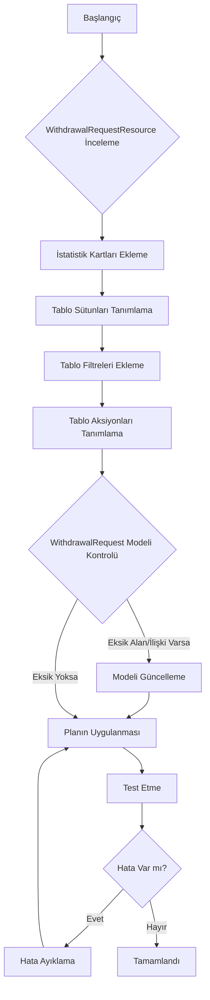

# Para Çekme Talepleri Yönetimi Sayfası Geliştirme Planı

Bu plan, `/admin/withdrawal-requests` sayfasını, sağlanan görüntüdeki istatistik kartları, tablo sütunları, filtreler ve aksiyonları içerecek şekilde Filament kullanarak geliştirmeyi amaçlamaktadır.

## Mevcut Durum Analizi

`app/Filament/Resources/WithdrawalRequestResource.php` dosyası incelendiğinde, Filament kaynağının temel bir yapıya sahip olduğu ve form, tablo, filtreler ve aksiyonlar bölümlerinin büyük ölçüde boş olduğu görülmüştür. Sadece temel bir düzenleme aksiyonu ve toplu silme aksiyonu tanımlıdır. `ClicksRelationManager` ilişkisi mevcuttur.

## Geliştirme Adımları

### Adım 1: İstatistik Kartlarını Ekleme

*   Sayfanın üst kısmında görüntülenen istatistik kartları (`Publishers Available Balance`, `Referral Earnings`, `Pending Withdrawn`, `Total Withdraw`) eklenecektir.
*   Bu kartlar için `app/Filament/Widgets/WithdrawalStatsOverview.php` gibi yeni bir Filament Widget sınıfı oluşturulacaktır.
*   Widget içinde gerekli Eloquent sorguları yazılarak istatistik verileri çekilecektir.
*   Oluşturulan Widget, `app/Filament/Resources/WithdrawalRequestResource/Pages/ListWithdrawalRequests.php` dosyasına eklenerek sayfanın üst kısmında gösterilecektir.

### Adım 2: Tablo Sütunlarını Tanımlama

*   `app/Filament/Resources/WithdrawalRequestResource.php` dosyasındaki `table()` metoduna gidilerek görüntüdeki tüm sütunlar eklenecektir.
*   Eklenecek sütunlar: `ID`, `User`, `Date`, `Status`, `Publisher Earnings`, `Referral Earnings`, `Total Amount`, `Withdrawal Method`, `Withdrawal Account`, `Action`.
*   `User` sütunu için `Tables\Columns\TextColumn::make('user.name')` gibi bir ilişki sütunu kullanılacaktır. Bunun için `App\Models\WithdrawalRequest` modelinde `user` adında bir `belongsTo` ilişkisinin tanımlı olması gerekmektedir.
*   Kazanç ve miktar sütunları için `Tables\Columns\TextColumn::make(...)` kullanılacak ve uygun formatlama (örneğin `->money('USD')` veya `->numeric()`) uygulanacaktır.
*   `Status` sütunu için `Tables\Columns\TextColumn::make('status')` kullanılacak ve durum değerlerine göre renk kodlaması veya ikonlar eklenmesi değerlendirilecektir.

### Adım 3: Tablo Filtrelerini Ekleme

*   `app/Filament/Resources/WithdrawalRequestResource.php` dosyasındaki `table()` metodunun `filters()` bölümüne gidilerek görüntüdeki filtreler eklenecektir.
*   Eklenecek filtreler: `User Id` (metin girişi), `Status` (seçici), `Withdrawal Method` (seçici).
*   `User Id` filtresi için `Filament\Tables\Filters\Filter::make('user_id')` yapısı kullanılacak ve içine `Filament\Forms\Components\TextInput::make('user_id')` form bileşeni yerleştirilecektir. Sorgu mantığı `query()` metodu içinde tanımlanacaktır.
*   `Status` ve `Withdrawal Method` filtreleri için `Filament\Tables\Filters\SelectFilter::make(...)` kullanılacaktır. Seçenekler ilgili model alanlarından veya sabit listelerden alınacaktır.

### Adım 4: Tablo Aksiyonlarını Tanımlama

*   `app/Filament/Resources/WithdrawalRequestResource.php` dosyasındaki `table()` metodunun `actions()` bölümüne gidilerek para çekme talepleri üzerinde işlem yapma aksiyonları eklenecektir.
*   Genellikle "Görüntüle", "Onayla", "Reddet", "Ödendi Olarak İşaretle" gibi aksiyonlar eklenmesi beklenmektedir.
*   Bu aksiyonlar `Tables\Actions\Action::make(...)` veya önceden tanımlanmış aksiyon sınıfları kullanılarak eklenecektir.
*   Her aksiyon için gerekli iş mantığı (veritabanı güncelleme, bildirim gönderme vb.) tanımlanacaktır.

### Adım 5: WithdrawalRequest Modeli Kontrolü ve Güncelleme

*   `App\Models\WithdrawalRequest.php` dosyası incelenerek gerekli alanların (`user_id`, `status`, `withdrawal_method`, kazanç ve miktar alanları) ve `user` adında bir `belongsTo` ilişkisinin tanımlı olup olmadığı kontrol edilecektir.
*   Eksik olan alanlar veya `user` ilişkisi modele eklenecektir.

### Adım 6: Planın Uygulanması

*   Yukarıdaki adımlar sırasıyla uygulanarak `WithdrawalRequestResource` dosyası ve gerekiyorsa `WithdrawalRequest` modeli güncellenecektir.
*   Gerekiyorsa yeni Widget dosyası oluşturulacaktır.

## Geliştirme Akışı

Bu plan onaylandıktan sonra, uygulamaya geçmek için Code moduna geçiş yapılacaktır.